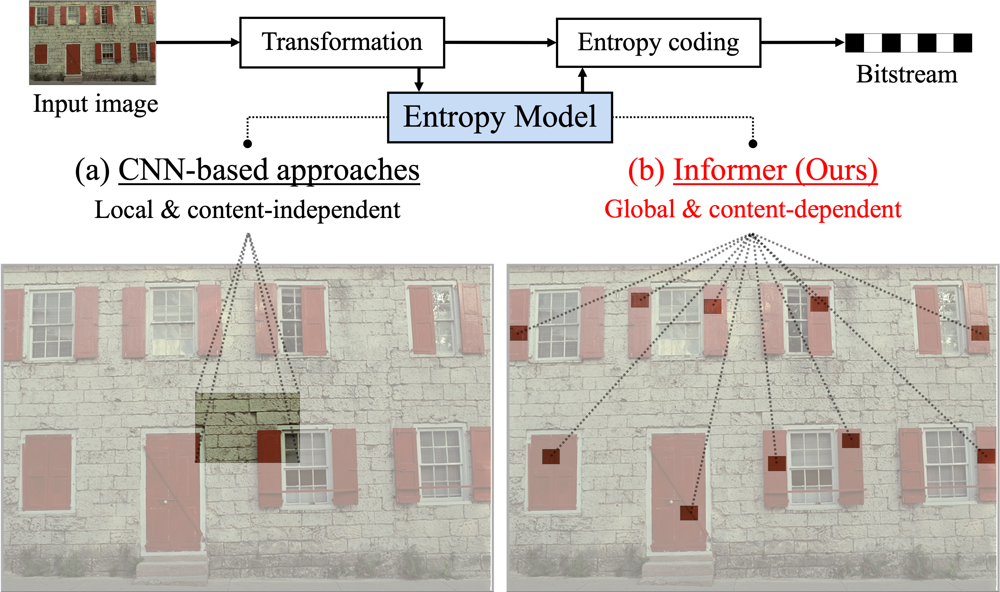
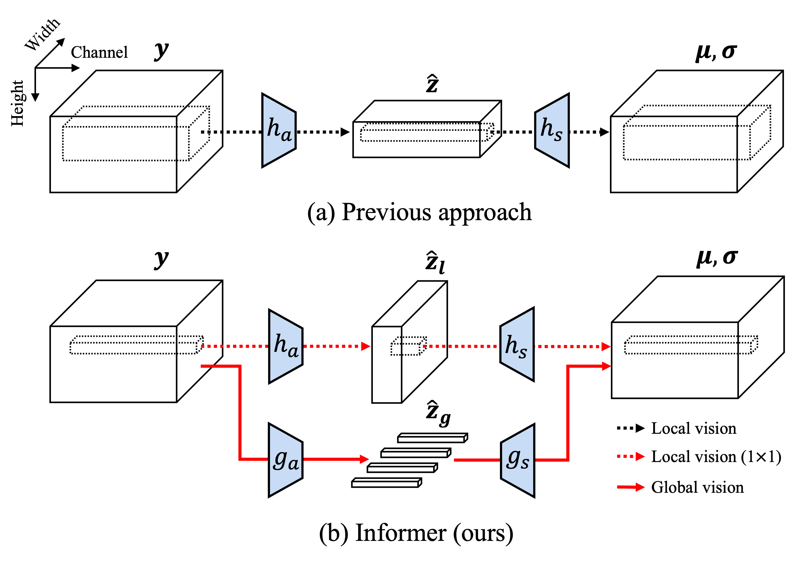

# Joint Global and Local Hierarchical Priors for Learned Image Compression (CVPR 2022) | [paper](https://openaccess.thecvf.com/content/CVPR2022/html/Kim_Joint_Global_and_Local_Hierarchical_Priors_for_Learned_Image_Compression_CVPR_2022_paper.html)

 

Officical PyTorch implementation of Informer 

**Jun-Hyuk Kim**<sup>1</sup>  **Byeongho Heo**<sup>2</sup>  **Jong-Seok Lee**<sup>1</sup><br>
<sup>1</sup>School of Integrated Technology, Yonsei University  <sup>2</sup> NAVER AI Lab<br> 

## Abstract 

Recently, learned image compression methods have outperformed traditional hand-crafted ones including BPG. One of the keys to this success is learned entropy models that estimate the probability distribution of the quantized latent representation. Like other vision tasks, most recent learned entropy models are based on convolutional neural networks (CNNs). However, CNNs have a limitation in modeling long-range dependencies due to their nature of local connectivity, which can be a significant bottleneck in image compression where reducing spatial redundancy is a key point. To overcome this issue, we propose a novel entropy model called Information Transformer (Informer) that exploits both global and local information in a contentdependent manner using an attention mechanism. Our experiments show that Informer improves rate–distortion performance over the state-of-the-art methods on the Kodak and Tecnick datasets without the quadratic computational complexity problem.

## Training
```shell 
CUDA_VISIBLE_DEVICES=0 python train.py \
-exp <path of experiments> \
--dataset <path of the training dataset> \
--test-dataset <path of the evaluation dataset> \
-e 250 \
--seed 777 \
--num-workers 4 \
--metric mse \
--lambda 0.0067 \
--quality 3 \
-lr 1e-4 \
--cuda
```

## Citation
If you find this work useful in your research, please cite this paper:
```
@inproceedings{kim2022informer,
  title={Joint Global and Local Hierarchical Priors for Learned Image Compression},
  author={Kim, Jun-Hyuk, and Heo, Byeongho and Lee, Jong-Seok},
  booktitle={Proceedings of the IEEE/CVF Conference on Computer Vision and Pattern Recognition (CVPR)},
  year={2022}
}
